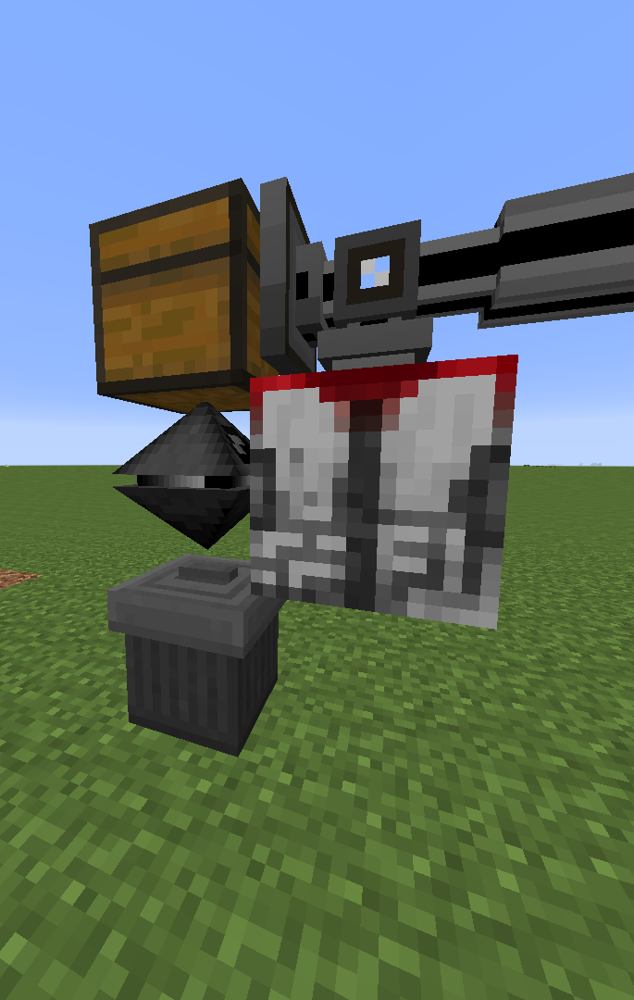

# autodire

## Requirements
- An ME System storing, or capable of autocrafting all ingredients 
- Extra Cells ME Upgrade linked to said ME System
- A Robot
- A Dire Autocrafting Table(expensive!)

## Setup
  
*The Trash Can can be replaced with a chest to regain the request items*
- Input the recipe into the Dire Autocrafting Table
- Put all required items into a database upgrade. If an item is needed more than once just put it multiple times
- Insert the database upgrade into the robot
- Run the program

# Operation
When the robot detects items in the top chest it will request/craft all items from the database upgrade and 
extract them to its front. Once this is done a single item from the top chest will be moved to the chest
down below as a sort of "Acknowledgement" that the request has been completed(also the robot would get stuck in an infinite loop otherwise).
Theoretically this can be used to craft anything consisting of more than 9 different items, not just the Dire Crafting Table.
